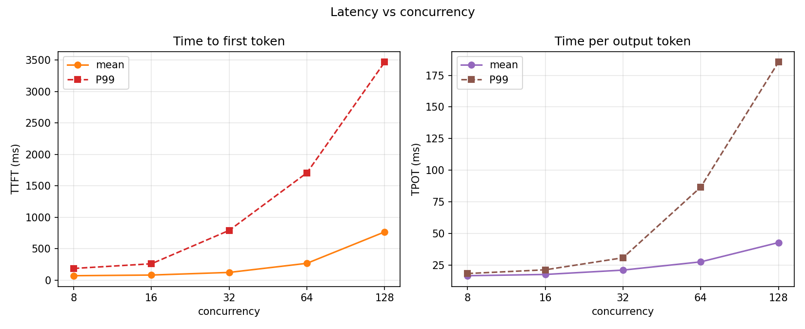
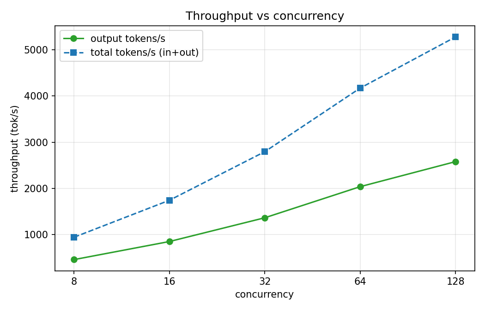
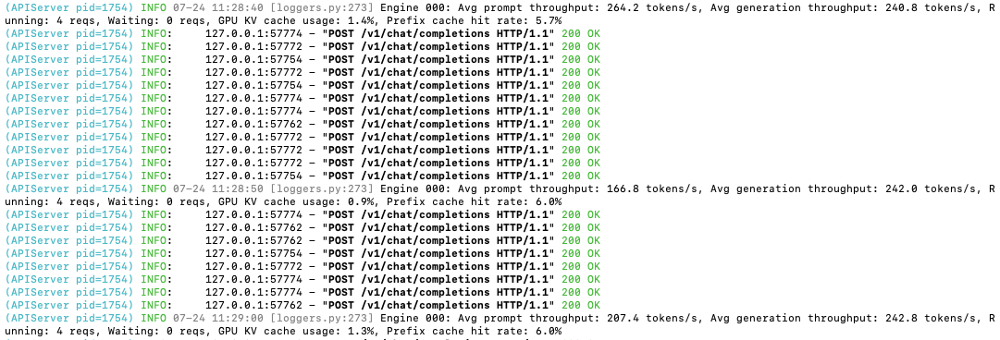
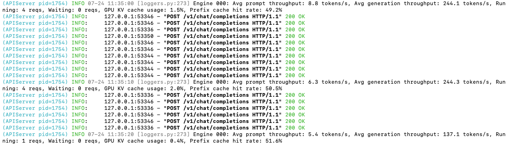

# 并发性能压测

## 1 实验结论

在 RTX 4090 上部署 Qwen2.5-7B-Instruct，使用 ShareGPT 数据集，在并发 8/16/32/64/128 下压测，得到以下结论：

- **吞吐随并发上升**：并发越高，单位时间处理的 token 数越多。
- **延迟随并发上升**：并发越高，TTFT 与 TPOT 均随之增加。
- **并发 128 尚未触及上限**：并发 128 时 vLLM 日志显示 `Waiting: 0 reqs, GPU KV cache usage: 36.4%`，即没有排队请求、KV cache 仍有余量，说明该数据集下并发 128 还不是上限。

延迟随并发的变化：



吞吐随并发的变化：



> 补充发现：vLLM 默认开启 prefix cache，用同一数据集连续压测时命中率会逐次升高，从而拉低 TTFT。为保证多次压测结果可比，后续实验均关闭 prefix cache（详见 [3.1](#31-试用-vllm-bench-serve-命令)）。

## 2 指标说明

| 指标 | 含义 |
| --- | --- |
| 吞吐 | 单位时间内处理的 token 数（tok/s） |
| TTFT | Time To First Token，从发出请求到收到第一个 token 的耗时 |
| TPOT | Time Per Output Token，首 token 之后，平均每生成一个 token 的耗时 |

## 3 实验过程

### 3.1 下载数据集

这里以 ShareGPT 为例，首先下载数据集：

```bash
wget https://hf-mirror.com/datasets/anon8231489123/ShareGPT_Vicuna_unfiltered/resolve/main/ShareGPT_V3_unfiltered_cleaned_split.json
```

### 3.2 试用 vllm bench serve 命令

`vllm bench serve` 是 vLLM 源码自带的压测工具，下面先试用一下。

按照 [readme.md](../readme.md) 中的命令启动 vLLM 服务、加载 qwen2.5-7b-instruct 模型，然后在另一个终端窗口执行：

```bash
vllm bench serve \
  --model /root/autodl-tmp/qwen2_5-7b-instruct/ \
  --served_model_name qwen2.5-7b-instruct \
  --backend openai-chat \
  --endpoint /v1/chat/completions \
  --dataset-name sharegpt \
  --dataset-path /root/datasets/ShareGPT_V3_unfiltered_cleaned_split.json \
  --num-prompts 200 \
  --max-concurrency 4
```

注意 `--backend` 与 `--endpoint` 参数需要配套；对于 ShareGPT 数据集，`--backend` 取 `openai-chat`。

第一次运行输出：

```
============ Serving Benchmark Result ============
Successful requests:                     200       
Failed requests:                         0         
Maximum request concurrency:             4         
Benchmark duration (s):                  184.01    
Total input tokens:                      49360     
Total generated tokens:                  42866     
Request throughput (req/s):              1.09      
Output token throughput (tok/s):         232.95    
Peak output token throughput (tok/s):    249.00    
Peak concurrent requests:                11.00     
Total token throughput (tok/s):          501.19    
---------------Time to First Token----------------
Mean TTFT (ms):                          65.96     
Median TTFT (ms):                        52.74     
P99 TTFT (ms):                           129.83    
-----Time per Output Token (excl. 1st token)------
Mean TPOT (ms):                          16.48     
Median TPOT (ms):                        16.31     
P99 TPOT (ms):                           19.06     
---------------Inter-token Latency----------------
Mean ITL (ms):                           16.34     
Median ITL (ms):                         16.21     
P99 ITL (ms):                            20.40     
==================================================
```

再次运行同一命令，输出：

```
============ Serving Benchmark Result ============
Successful requests:                     200       
Failed requests:                         0         
Maximum request concurrency:             4         
Benchmark duration (s):                  183.15    
Total input tokens:                      49360     
Total generated tokens:                  43293     
Request throughput (req/s):              1.09      
Output token throughput (tok/s):         236.38    
Peak output token throughput (tok/s):    249.00    
Peak concurrent requests:                11.00     
Total token throughput (tok/s):          505.89    
---------------Time to First Token----------------
Mean TTFT (ms):                          50.58     
Median TTFT (ms):                        48.11     
P99 TTFT (ms):                           70.63     
-----Time per Output Token (excl. 1st token)------
Mean TPOT (ms):                          16.23     
Median TPOT (ms):                        16.23     
P99 TPOT (ms):                           16.42     
---------------Inter-token Latency----------------
Mean ITL (ms):                           16.15     
Median ITL (ms):                         16.20     
P99 ITL (ms):                            18.28     
==================================================
```

对比两次结果，第二次运行的 TTFT 显著优于第一次。结合 vLLM server 日志：第一次运行时 Prefix cache hit rate 较低，最高仅 6%–7%；第二次运行时则从 7% 逐渐上涨到 50%。由此推断，vLLM 引擎默认开启 prefix cache，用同一数据集连续压测时命中率会升高，从而明显改善第二次的 TTFT。

第一次运行日志：


第二次运行日志：


为排除 prefix cache 的影响，启动 vLLM 服务时关闭该功能：

```bash
vllm serve /root/autodl-tmp/qwen2_5-7b-instruct/ \
    --served_model_name qwen2.5-7b-instruct \
    --port 8000 \
    --no-enable-prefix-caching
```

再次连续运行两次上述 `vllm bench serve` 命令，两次指标基本一致。因此，后续用同一数据集连续压测时均关闭 prefix cache，以保证结果的可比性。

### 3.3 编写脚本压测不同并发

脚本在 [/src](../src/) 文件夹中，在并发 8/16/32/64/128 下分别压测，观察不同并发下的性能表现。

```bash
# vLLM server 已在另一个终端跑着
python run_sweep.py \
  --model /root/autodl-tmp/qwen2_5-7b-instruct/ \
  --served-model-name qwen2.5-7b-instruct \
  --dataset-path /root/datasets/ShareGPT_V3_unfiltered_cleaned_split.json \
  --outdir run1 \
  --concurrency 8,16,32,64,128 --num-prompts 400
```

绘制实验结果：

```bash
python plot.py --windows run1/windows.jsonl --outdir run1
```

结果图见 [第 1 节](#1-实验结论)。可以看到，随着并发增加，TTFT/TPOT 不断上升，吞吐也不断上升。

并发 128 时，vLLM server 有如下日志，`Waiting: 0 reqs, GPU KV cache usage: 36.4%` 说明当前没有排队请求，并发 128 还不是该数据集的并发上限：

```
(APIServer pid=7151) INFO 07-24 14:10:08 [loggers.py:273] Engine 000: Avg prompt throughput: 3539.1 tokens/s, Avg generation throughput: 3562.1 tokens/s, Running: 126 reqs, Waiting: 0 reqs, GPU KV cache usage: 36.4%, Prefix cache hit rate: 0.0%
```
