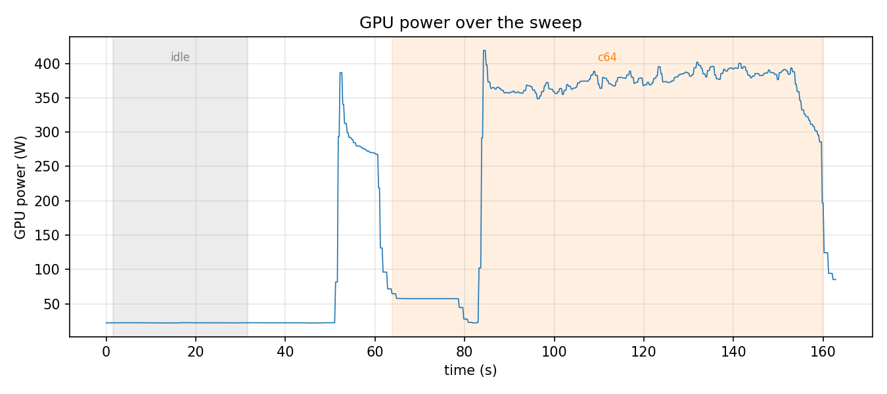
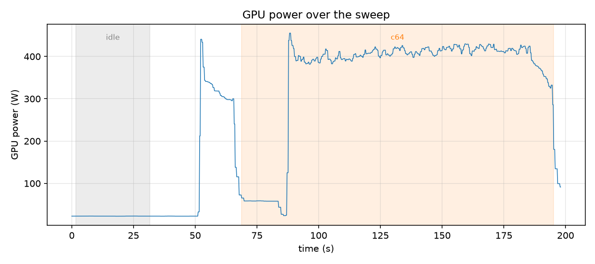

# 量化模型对比

对比 Qwen2.5-7B-Instruct 在量化前后的性能、精度与显存占用。原始模型权重为 bf16，量化方式为 vLLM 的在线动态量化（online dynamic）fp8。

## 1 实验结论

在 RTX 4090 上，使用 ShareGPT 压测性能与能耗、GSM8K 评测精度，fp8 相比 bf16 的表现如下：

- **吞吐显著提升**：各并发下输出吞吐提高约 **34%–47%**，并发 128 时总吞吐从 5274.6 提升到 7068.0 tok/s。
- **延迟全面下降**：mean TPOT 降低约 **25%–32%**，mean TTFT 降低约 **18%–27%**。
- **精度基本无损**：GSM8K（flexible-extract）fp8 70.58% vs bf16 69.60%，差异约 1 个百分点，落在标准误内，统计上不可区分。
- **能耗大幅下降**：完成等量 token（并发 64），每输出 token 能耗从 0.176 J 降至 0.113 J，整体节能约 **36%**，且主要来自更高吞吐带来的耗时缩短。
- **显存占用更低**：fp8 加载占用的显存明显少于 bf16，为更大 batch / 更长上下文留出余量。

**综合结论**：在本实验负载下，fp8 在线动态量化在性能、精度、能耗与显存四个维度上全面占优；详细数据见 [5.1 性能压测对比](#51-性能压测对比)、[5.2 精度对比](#52-精度对比) 与 [5.3 能耗对比](#53-能耗对比)。

## 2 量化方式

按照 [readme.md](../readme.md) 中的说明准备环境。原始模型为 Qwen/Qwen2.5-7B-Instruct，权重精度为 bf16。

本实验采用 vLLM 内置的 **fp8 在线动态量化（online dynamic quantization）**，属于 W8A8（权重与激活均为 8-bit）方案，具体特点如下：

- **无需校准数据**：不依赖任何校准集或离线量化流程，服务启动加载权重时即完成量化，是一种 post-training、零校准的量化方式，接入成本最低。
- **权重量化**：所有 Linear 层（`lm_head` 除外）的权重被量化为 `FP8_E4M3`（1 符号位 + 4 指数位 + 3 尾数位），采用 per-tensor 缩放，即整个权重张量共享一个静态 scale，在加载时一次性算好。
- **激活量化**：激活值在每次前向传播中动态统计其数值范围，实时计算 per-tensor 的动态 scale 后再量化；动态 scale 能更好地适配不同输入的分布，减小量化误差。
- **量化范围**：仅量化 attention 的 `qkv_proj`/`o_proj` 与 MLP 的 `gate`/`up`/`down_proj` 等权重矩阵（模型的主要计算量与显存占用所在），而 embedding、LayerNorm、`lm_head` 保持原精度——这些层要么对量化误差敏感，要么参数占比很小，量化收益有限。

fp8 矩阵乘法可直接利用 Ada 架构（RTX 4090）的 FP8 Tensor Core，在降低权重显存占用的同时提升计算吞吐，因此本实验优先选用该方案。

## 3 压测数据集

压测数据集，我们仍选择 ShareGPT：

```bash
wget https://hf-mirror.com/datasets/anon8231489123/ShareGPT_Vicuna_unfiltered/resolve/main/ShareGPT_V3_unfiltered_cleaned_split.json
```

## 4 精度评测方法

模型精度的衡量通常需要在多个数据集上综合测试，这里仅以 GSM8K（Hugging Face: openai/gsm8k）数据集为例。GSM8K 包含约 8,500 道高质量的小学数学应用题，常用于评测模型的数学推理能力。

评测框架采用 lm-eval（EleutherAI 的 lm-evaluation-harness 的简称），它是当前大语言模型（LLM）开源社区中较为权威、使用广泛的标准化评测框架。

```
pip install lm-eval
pip install lm-eval[api]
```


## 5 实验步骤

使用 vLLM 将模型在线动态量化为 fp8，只需在启动 vLLM 服务时加上 `--quantization fp8` 参数：

```bash
vllm serve /root/autodl-tmp/qwen2_5-7b-instruct/ \
    --quantization fp8 \
    --served_model_name qwen2.5-7b-instruct-fp8 \
    --port 8000 \
    --no-enable-prefix-caching
```

从 vLLM 的启动日志可见，fp8 加载占用的显存明显少于 bf16，为更大 batch / 更长上下文留出余量。


### 5.1 性能压测对比

参考[并发性能压测](exp_concurrency_performance.md) 中的性能压测方法，对动态量化的 fp8 模型进行压测

```bash
# vLLM server 在线动态量化已在另一个终端跑着
python run_sweep.py \
  --model /root/autodl-tmp/qwen2_5-7b-instruct/ \
  --served-model-name qwen2.5-7b-instruct-fp8 \
  --dataset-path /root/datasets/ShareGPT_V3_unfiltered_cleaned_split.json \
  --outdir run4 \
  --concurrency 8,16,32,64,128 --num-prompts 400
```

```bash
python plot.py --windows run4/windows.jsonl --outdir run4
```

将 fp8 量化模型（run4）与原始 bf16 模型（[并发性能压测 run1](exp_concurrency_performance.md)）在相同并发下对比：

| 并发 | 输出吞吐 (tok/s) bf16 → fp8 | mean TTFT (ms) bf16 → fp8 | mean TPOT (ms) bf16 → fp8 |
| ---: | --- | --- | --- |
| 8   | 463.1 → 676.5（+46%） | 69.4 → 56.6（-18%） | 16.7 → 11.4（-32%） |
| 16  | 853.6 → 1236.3（+45%） | 80.1 → 64.5（-19%） | 17.7 → 12.2（-31%） |
| 32  | 1367.1 → 2002.4（+47%） | 121.5 → 92.7（-24%） | 21.2 → 14.5（-32%） |
| 64  | 2039.2 → 2859.8（+40%） | 266.6 → 201.3（-24%） | 27.7 → 19.8（-29%） |
| 128 | 2580.0 → 3457.2（+34%） | 766.2 → 557.2（-27%） | 42.9 → 32.0（-25%） |

**结论：**

- **吞吐显著提升**：fp8 在各并发下输出吞吐比 bf16 高约 **34%–47%**；并发 128 时总吞吐从 5274.6 提升到 7068.0 tok/s。
- **延迟全面下降**：mean TPOT 降低约 **25%–32%**，直接得益于 fp8 计算/访存更快；mean TTFT 也下降约 **18%–27%**。
- **收益随并发变化的趋势相反**：吞吐的相对优势随并发升高而收窄（46% → 34%，高并发下逐渐受 KV cache、调度等非量化因素制约），而 TTFT 的相对优势随并发升高而扩大（18% → 27%，量化后单步更快，在高并发排队时更能摊薄首 token 等待）。


### 5.2 精度对比

对量化模型在 GSM8K 上进行精度测试，结果输出到 [eval_fp8](../experiment_results/quantized_model/eval_fp8) 中

```
lm_eval --model local-chat-completions \
  --model_args model=qwen2.5-7b-instruct-fp8,base_url=http://localhost:8000/v1/chat/completions,num_concurrent=8,tokenized_requests=False,add_bos_token=True \
  --tasks gsm8k \
  --apply_chat_template \
  --output_path eval_fp8/
```

对原始模型在 GSM8K 上进行精度测试，结果输出到 [eval_bf16](../experiment_results/quantized_model/eval_bf16) 中

```
lm_eval --model local-chat-completions \
  --model_args model=qwen2.5-7b-instruct,base_url=http://localhost:8000/v1/chat/completions,num_concurrent=8,tokenized_requests=False,add_bos_token=True \
  --tasks gsm8k \
  --apply_chat_template \
  --output_path eval_bf16/
```

两个模型在 GSM8K（1319 题）上的 exact-match 准确率如下（括号为标准误）：

| 模型 | flexible-extract | strict-match |
| --- | ---: | ---: |
| bf16（原始） | 69.60% (±1.27%) | 16.83% (±1.03%) |
| fp8（量化） | 70.58% (±1.26%) | 19.79% (±1.10%) |

**结论：**

- **精度基本无损**：以 flexible-extract 为准（该指标从回答中提取最后一个数字，反映真实推理能力），fp8 为 70.58%，bf16 为 69.60%，相差仅约 1 个百分点，且落在两者标准误范围内（差值 ≈1.0pp < 合并标准误 ≈1.8pp），统计上不可区分。fp8 甚至略高，属正常波动。
- **strict-match 两者都很低，不宜作为对比依据**：strict-match 要求回答严格匹配 `#### 数字` 格式，Qwen2.5-Instruct 的自由格式回答大多不满足，故 bf16/fp8 都只有约 17%–20%，这是格式解析问题而非推理能力差异。

### 5.3 能耗对比

使用 ShareGPT 数据集在并发为 64 的情况下对 fp8 量化模型和原始模型进行压测，观察压测过程中 GPU 的能耗情况。

对量化模型进行压测：

```
python run_sweep.py \
  --model /root/autodl-tmp/qwen2_5-7b-instruct/ \
  --served-model-name qwen2.5-7b-instruct-fp8 \
  --dataset-path /root/datasets/ShareGPT_V3_unfiltered_cleaned_split.json \
  --sampler-out energy_fp8.csv \
  --concurrency 64 --num-prompts 1200 \
  --outdir run7
```

```
python plot.py --csv energy_fp8.csv --windows run7/windows.jsonl --outdir run7
```

量化模型 GPU 能耗随时间的变化情况：



对原始模型进行压测：

```
python run_sweep.py \
  --model /root/autodl-tmp/qwen2_5-7b-instruct/ \
  --served-model-name qwen2.5-7b-instruct \
  --dataset-path /root/datasets/ShareGPT_V3_unfiltered_cleaned_split.json \
  --sampler-out energy_bf16.csv \
  --concurrency 64 --num-prompts 1200 \
  --outdir run8
```

```
python plot.py --csv energy_bf16.csv --windows run8/windows.jsonl --outdir run8
```

原始模型 GPU 能耗随时间的变化情况：


由于开启了 `--ignore-eos`，两次压测生成的 token 数完全相同（输出 237,180 tokens、输入 301,541 tokens），因此这是一次**等工作量**的能耗对照。能耗为累计能量计数器（`nvmlDeviceGetTotalEnergyConsumption`）在区间两端的差值（end − start）。

> **口径说明（能耗与时间取同一区间）**：`run_sweep.py` 记录的 measured 窗口是 `[t_start, t_end]`，它包住了整个 `vllm bench serve` 子进程。窗口开头约有 18–19s 的 **padding**——子进程刚启动、正在连接服务、加载数据集与 tokenizer 并做自身预热，此时还没真正发请求、GPU 仍近乎空闲（即 power timeline 橙色段最左侧那段低功率、尚未出现尖峰的区间）。为避免这段近空闲时间稀释功率、且让**能耗与耗时落在完全相同的区间**上，下表统一取 benchmark 的实际压测区间 `[t_end − duration, t_end]` 计算（`duration` 为 benchmark 自报的压测时长）。两个模型的 padding 时长相近（约 18s vs 19s）、token 数又完全相同，因此该口径下的对比是严格等价的。

| 指标 | bf16（原始，run8） | fp8（量化，run7） | 变化 |
| --- | ---: | ---: | ---: |
| 压测耗时 (s) | 107.9 | 76.6 | **-29%** |
| 平均功率 (W) | 404 | 371 | -8% |
| 峰值功率 (W) | 455 | 419 | -8% |
| 压测能耗 (J) | 41,727 | 26,807 | **-36%** |
| 每输出 token 能耗 (J/token) | 0.176 | 0.113 | **-36%** |
| 每总 token 能耗 (J/token) | 0.0775 | 0.0498 | **-36%** |

**结论：**

- **能耗显著降低**：完成同样的 237,180 个输出 token，fp8 比 bf16 节省约 **36%** 的能量（41.7 kJ → 26.8 kJ），每输出 token 能耗从 0.176 J 降至 0.113 J。
- **节能主要来自"跑得更快"，而非"每一步更省电"**：能量 = 功率 × 时间，在工作量相同的前提下，fp8 的稳态平均功率仅低约 8%，但压测耗时缩短约 29%，两者相乘 `(1-8%)×(1-29%) ≈ 0.65`，对应约 36% 的总能耗下降。可见量化省电的主导因素是**更高的吞吐缩短了高功耗时间**——这与 [5.1](#51-性能压测对比) 中并发 64 下吞吐 +40%（耗时 -29% 恰好对应吞吐提升约 41%）完全自洽。
- **功率曲线印证**：对比两张 power timeline，压测段（橙色）内 bf16 的满载平台稳定在约 390–430 W，而 fp8 只有约 350–390 W；同时 fp8 的橙色压测段明显更窄（更早结束）。两条曲线都先出现一个功率尖峰（bf16 峰值 455 W、fp8 419 W）再回落到平台：尖峰对应请求刚进入时的 prefill 阶段（一次性处理整段 prompt，计算密集、Tensor Core 高占用），平台对应随后的 decode 阶段（逐 token 自回归生成，访存密集、功率较低）。
- **与性能、精度结论一致**：能耗优势与 [5.1](#51-性能压测对比) 的吞吐/延迟提升同源——fp8 的 FP8 Tensor Core 让单步更快、单位算力功耗更低；结合 [5.2](#52-精度对比) 的精度基本无损，fp8 在线动态量化在本实验中实现了**性能、精度、能耗**的全面优化。

