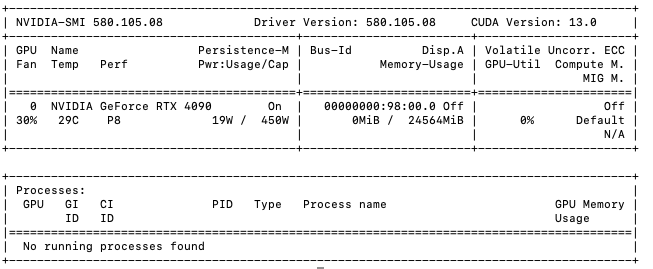
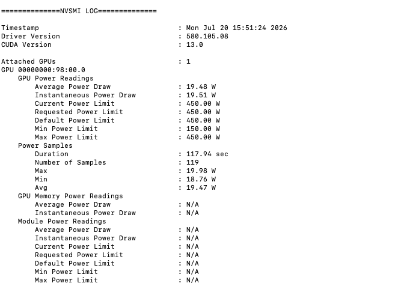
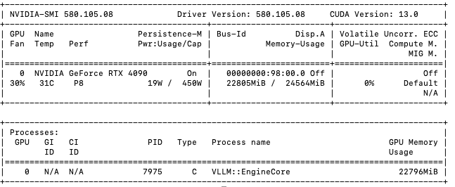
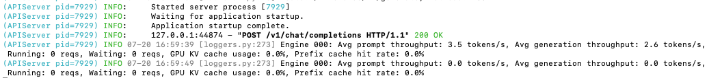
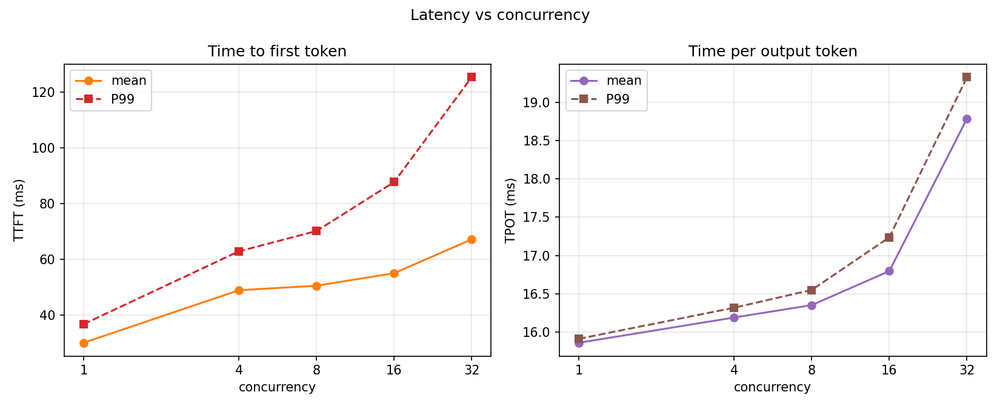
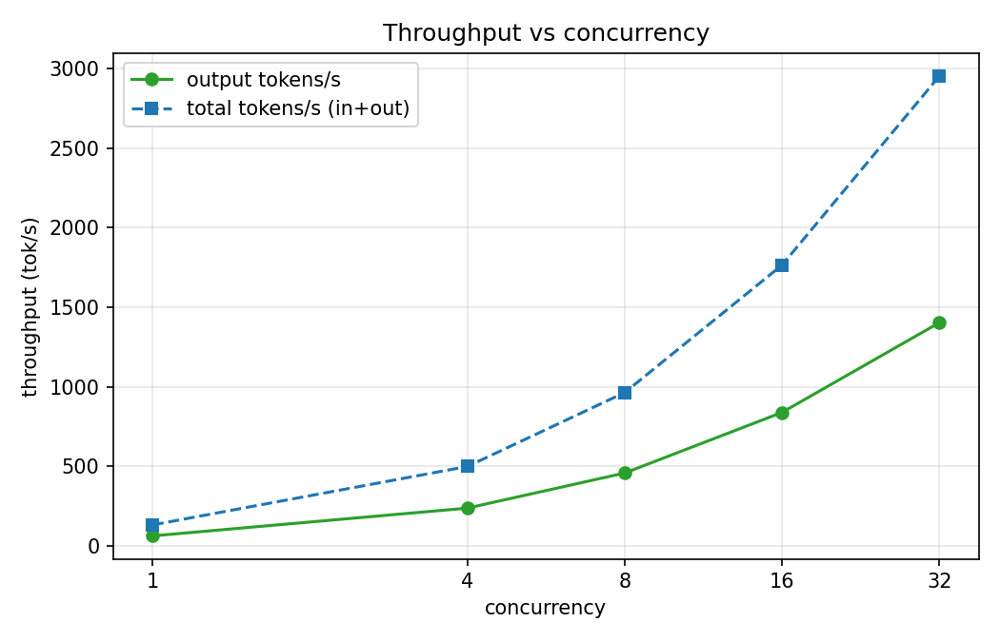
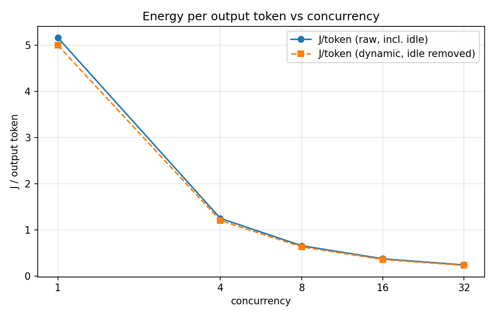
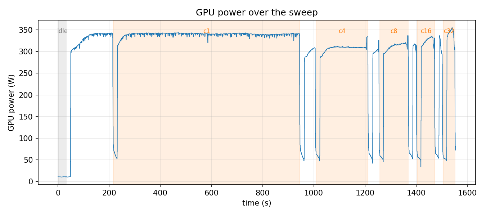

# 实验方法

## 1. 启动 vLLM 服务

### 1.1 机器与镜像

从 autodl 上选择了一台 RTX 4090，基础镜像为 Python 3.12 + PyTorch 2.12.1 + CUDA 13.0。

### 1.2 查看 GPU 状态

用 `nvidia-smi` 查看 GPU 状态总览：



用 `nvidia-smi -q -d POWER` 查看 GPU 功耗相关的详细信息：



再验证一下能否通过代码使用 NVML 读取 GPU 状态：

```bash
pip install nvidia-ml-py
```

```python
import pynvml

pynvml.nvmlInit()
h = pynvml.nvmlDeviceGetHandleByIndex(0)

# 累计能耗（毫焦 mJ）
energy = pynvml.nvmlDeviceGetTotalEnergyConsumption(h)
print("能耗计数器(mJ):", energy)

# 瞬时功率（毫瓦 mW）
power = pynvml.nvmlDeviceGetPowerUsage(h)
print("当前功率(mW):", power)

pynvml.nvmlShutdown()
```

### 1.3 安装 vLLM

```bash
pip install vllm
```

```bash
vllm --version
# 0.25.1
```

### 1.4 下载模型

从 modelscope 下载模型（国内友好）：

```bash
pip install modelscope
modelscope download --model Qwen/Qwen2.5-7B-Instruct \
    --local_dir /root/autodl-tmp/qwen2_5-7b-instruct
```

### 1.5 启动服务

```bash
vllm serve /root/autodl-tmp/qwen2_5-7b-instruct/ \
    --served_model_name qwen2.5-7b-instruct \
    --port 8000
```

这里加上 `--served_model_name` 是指定调用 API 时需要填写的模型名；不指定的话，模型名就是本地文件路径了。

从日志中可以看到模型加载花费了 4.55 秒。

### 1.6 验证服务

开启另一个终端发起请求：

```bash
curl http://localhost:8000/v1/models
```

```bash
curl http://localhost:8000/v1/chat/completions \
  -H "Content-Type: application/json" \
  -d '{
    "model": "qwen2.5-7b-instruct",
    "messages": [{"role": "user", "content": "你好，用一句话介绍你自己"}]
  }'
```

能够正确得到回复。

此时的 GPU 概览：



此时的 server 日志：



## 2. 使用 vllm bench serve 进行压测

### 2.1 指标说明

| 指标 | 含义 |
| --- | --- |
| 吞吐 | 单位时间内处理的 token 数（tok/s） |
| TTFT | Time To First Token，从发出请求到收到第一个 token 的耗时 |
| TPOT | Time Per Output Token，首 token 之后，平均每生成一个 token 的耗时 |

### 2.2 压测方法

下载数据集：

```bash
wget https://hf-mirror.com/datasets/anon8231489123/ShareGPT_Vicuna_unfiltered/resolve/main/ShareGPT_V3_unfiltered_cleaned_split.json
```

固定 `--num-prompts 200`，只改变 `--max-concurrency`，依次取 1、4、8、16、32：

```bash
vllm bench serve \
  --model /root/autodl-tmp/qwen2_5-7b-instruct/ \
  --served_model_name qwen2.5-7b-instruct \
  --dataset-name sharegpt \
  --dataset-path /root/datasets/ShareGPT_V3_unfiltered_cleaned_split.json \
  --num-prompts 200 \
  --max-concurrency <N>
```

刚刚发现，这样子测的是 /v1/completions 接口，不是 /v1/chat/completions 接口。

### 2.3 压测原始输出

并发为 1：

```text
============ Serving Benchmark Result ============
Successful requests:                     200       
Failed requests:                         0         
Maximum request concurrency:             1         
Benchmark duration (s):                  694.60    
Total input tokens:                      43560     
Total generated tokens:                  43491     
Request throughput (req/s):              0.29      
Output token throughput (tok/s):         62.61     
Peak output token throughput (tok/s):    63.00     
Peak concurrent requests:                5.00      
Total token throughput (tok/s):          125.33    
---------------Time to First Token----------------
Mean TTFT (ms):                          27.44     
Median TTFT (ms):                        26.71     
P99 TTFT (ms):                           36.55     
-----Time per Output Token (excl. 1st token)------
Mean TPOT (ms):                          15.90     
Median TPOT (ms):                        15.91     
P99 TPOT (ms):                           15.96     
---------------Inter-token Latency----------------
Mean ITL (ms):                           15.92     
Median ITL (ms):                         15.90     
P99 ITL (ms):                            17.16     
==================================================
```

并发为 4：

```text
============ Serving Benchmark Result ============
Successful requests:                     200       
Failed requests:                         0         
Maximum request concurrency:             4         
Benchmark duration (s):                  184.44    
Total input tokens:                      43560     
Total generated tokens:                  43786     
Request throughput (req/s):              1.08      
Output token throughput (tok/s):         237.41    
Peak output token throughput (tok/s):    248.00    
Peak concurrent requests:                10.00     
Total token throughput (tok/s):          473.59    
---------------Time to First Token----------------
Mean TTFT (ms):                          48.76     
Median TTFT (ms):                        48.59     
P99 TTFT (ms):                           59.06     
-----Time per Output Token (excl. 1st token)------
Mean TPOT (ms):                          16.22     
Median TPOT (ms):                        16.22     
P99 TPOT (ms):                           16.31     
---------------Inter-token Latency----------------
Mean ITL (ms):                           16.22     
Median ITL (ms):                         16.20     
P99 ITL (ms):                            18.18     
==================================================
```

并发为 8：

```text
============ Serving Benchmark Result ============
Successful requests:                     200       
Failed requests:                         0         
Maximum request concurrency:             8         
Benchmark duration (s):                  97.94     
Total input tokens:                      43560     
Total generated tokens:                  44124     
Request throughput (req/s):              2.04      
Output token throughput (tok/s):         450.51    
Peak output token throughput (tok/s):    496.00    
Peak concurrent requests:                15.00     
Total token throughput (tok/s):          895.27    
---------------Time to First Token----------------
Mean TTFT (ms):                          57.75     
Median TTFT (ms):                        50.50     
P99 TTFT (ms):                           115.21    
-----Time per Output Token (excl. 1st token)------
Mean TPOT (ms):                          16.60     
Median TPOT (ms):                        16.44     
P99 TPOT (ms):                           18.48     
---------------Inter-token Latency----------------
Mean ITL (ms):                           16.59     
Median ITL (ms):                         16.32     
P99 ITL (ms):                            20.17     
==================================================
```

并发为 16：

```text
============ Serving Benchmark Result ============
Successful requests:                     200       
Failed requests:                         0         
Maximum request concurrency:             16        
Benchmark duration (s):                  52.52     
Total input tokens:                      43560     
Total generated tokens:                  43964     
Request throughput (req/s):              3.81      
Output token throughput (tok/s):         837.13    
Peak output token throughput (tok/s):    958.00    
Peak concurrent requests:                26.00     
Total token throughput (tok/s):          1666.56   
---------------Time to First Token----------------
Mean TTFT (ms):                          54.32     
Median TTFT (ms):                        52.04     
P99 TTFT (ms):                           84.37     
-----Time per Output Token (excl. 1st token)------
Mean TPOT (ms):                          16.80     
Median TPOT (ms):                        16.82     
P99 TPOT (ms):                           17.15     
---------------Inter-token Latency----------------
Mean ITL (ms):                           16.82     
Median ITL (ms):                         16.70     
P99 ITL (ms):                            21.41     
==================================================
```

并发为 32：

```text
============ Serving Benchmark Result ============
Successful requests:                     200       
Failed requests:                         0         
Maximum request concurrency:             32        
Benchmark duration (s):                  34.43     
Total input tokens:                      43560     
Total generated tokens:                  44009     
Request throughput (req/s):              5.81      
Output token throughput (tok/s):         1278.33   
Peak output token throughput (tok/s):    1694.00   
Peak concurrent requests:                46.00     
Total token throughput (tok/s):          2543.61   
---------------Time to First Token----------------
Mean TTFT (ms):                          144.85    
Median TTFT (ms):                         76.44    
P99 TTFT (ms):                           769.86    
-----Time per Output Token (excl. 1st token)------
Mean TPOT (ms):                          21.40     
Median TPOT (ms):                        20.62     
P99 TPOT (ms):                           41.55     
---------------Inter-token Latency----------------
Mean ITL (ms):                           20.54     
Median ITL (ms):                         18.37     
P99 ITL (ms):                            73.99     
==================================================
```

### 2.4 压测数据统计

| 并发数 | 吞吐 (tok/s) | TTFT 均值 (ms) | TTFT-P99 (ms) | TPOT 均值 (ms) | TPOT-P99 (ms) |
| ---: | ---: | ---: | ---: | ---: | ---: |
| 1 | 125.33 | 27.44 | 36.55 | 15.90 | 15.96 |
| 4 | 473.59 | 48.76 | 59.06 | 16.22 | 16.31 |
| 8 | 895.27 | 57.75 | 115.21 | 16.60 | 18.48 |
| 16 | 1666.56 | 54.32 | 84.37 | 16.80 | 17.15 |
| 32 | 2543.61 | 144.85 | 769.86 | 21.40 | 41.55 |

> **吞吐**取 Total token throughput（输入 + 输出）。对应的 Output token throughput 依次为 62.61 / 237.41 / 450.51 / 837.13 / 1278.33 tok/s。

> 并发 16 的 TTFT 均值（54.32 ms）反而低于并发 8（57.75 ms），是因为并发 8 那次的 P99 被拖到了 115 ms（个别长请求），并非趋势异常。真正的拐点在并发 32：TTFT-P99 跳到 769.86 ms，TPOT-P99 翻倍到 41.55 ms，说明此时已经开始排队了。


# 3. 使用脚本进行压测，同时统计耗能数据

## 3.1 使用 vllm serve bench 进行压测

核心思路：性能和能耗在同一个时间窗口里并行采集,事后靠时间戳对齐拼起来。采样器和驱动跑在同一台机器，用同一个 wall-clock，没有时钟漂移问题

三个解耦模块：
- 压测模块:vllm bench serve 打 chat 端点,按并发档(1/4/8/16/32)逐档发 ShareGPT 请求,产出客户端侧的吞吐、TTFT、TPOT/ITL,存成 JSON。
- 能耗采样器:一个独立后台进程,每 200ms 读一次 NVML 的整卡计数器——累计能耗(mJ)、功率、利用率、显存、频率、温度——带时间戳写进 CSV。它不 import 任何引擎,GPU 上跑 vLLM 还是 SGLang 它都一样读。
- 离线对齐分析:把 CSV 和每档的时间窗口、benchmark JSON join 起来,算出每档的 J/token。

测量流程
- idle 窗口:模型常驻显存、不发任何请求,空测一段,拿到 idle 功率。
- warmup:先跑一轮小请求量丢弃,把冷启动和 CUDA graph 编译排除在正式数据外。
- 正式窗口:记下 t_start,跑正式 benchmark,记下 t_end,把这个窗口和对应的 result JSON 路径写进 windows.jsonl

能耗计算:在窗口两端对累计能耗计数器做插值取差值(end − start)，而不是拿瞬时功率去积分估。这个 delta 就是这一档的总能耗，除以 benchmark JSON 里服务端报的总输出 token，得到 J/token;另外再出 J/total-token、J/request。

### 3.1.2 首次压测

首先保证 vllm server 在一个终端被拉起， 在另外一个终端中（进入 src/）输入来获取实验数据：

```bash
# vLLM server 已在另一个终端跑着
python run_sweep.py \
  --model /root/autodl-tmp/qwen2_5-7b-instruct/ \
  --served-model-name qwen2.5-7b-instruct \
  --dataset-path /root/datasets/ShareGPT_V3_unfiltered_cleaned_split.json \
  --sampler-out energy.csv \
  --concurrency 1,4,8,16,32 --num-prompts 200
```

分析实验数据：
```bash
python analyze.py --csv energy.csv --windows run/windows.jsonl --out run/summary
```

绘图：
```bash
python plot.py --summary run/summary.csv --csv energy.csv \
               --windows run/windows.jsonl --outdir run
```

实验结果放在：/experiments/vllm_bench_serve/run1 中

实验结论：
- 性能上，随着并发的增加，TTFT/TPOT 不断增加，吞吐也不断上升，其中并发从 16 增加到 32 之后，TPOT 大幅增加；



- 耗能上，
  - 随着并发的增加，单位 token 的能耗不断下降，但下降幅度下降，有收敛的趋势。 说明目前的显存带宽是平静，而不是算力是瓶颈，batching 使得原本空转的算力用了起来。但随着算力逐渐达到饱和，单位 token 的能耗就回见底，可以增加并发找到这个拐点。
  
  - power_timeline 里并发 1 的平均功率(316.9W)反而比并发 4/8(275/264W)还高，反直觉。
    - 原因：avg_power_W = 窗口总能耗 / 窗口时长，窗口两端有客户端爬坡(GPU 没喂满)和收尾 drain 的低功耗段(~50W)。这段绝对时长基本固定，但窗口时长随并发暴跌(728s→46s)，所以短窗口(高并发)被稀释得厉害——窗口内 util<50% 的采样占比从并发 1 的 1.9% 一路涨到并发 32 的 31.6%。
    - 真相：只取 util≥90% 的稳态采样求平均，各档功率其实基本持平在 ~310–340W（并发 1 和 32 都顶在 ~340W）。batch=1 的 decode 是显存带宽瓶颈，每步都要读一遍全部权重，即使单路也把显存打满、SM 频率顶到最高，所以稳态功率一点不低。
    - 解决：analyze.py 新增 steady_power_W 列（util≥阈值再求平均，阈值由 --util-thresh 控制，默认 90），另出 steady_frac 记录窗口内满载采样占比。J/token 的能量仍用整窗口累计计数器差值(end−start)，不动。
  

### 3.1.2 改进后继续实验

首先保证 vllm server 在一个终端被拉起， 在另外一个终端中（进入 src/）输入来获取实验数据：

```bash
# vLLM server 已在另一个终端跑着
python run_sweep.py \
  --model /root/autodl-tmp/qwen2_5-7b-instruct/ \
  --served-model-name qwen2.5-7b-instruct \
  --dataset-path /root/datasets/ShareGPT_V3_unfiltered_cleaned_split.json \
  --sampler-out energy.csv \
  --concurrency 1,4,8,16,32,48,64 --num-prompts 500
```

分析实验数据：
```bash
python analyze.py --csv energy.csv --windows run/windows.jsonl --out run/summary
```

绘图：
```bash
python plot.py --summary run/summary.csv --csv energy.csv \
               --windows run/windows.jsonl --outdir run
```


## 3.2 理解 vllm bench 压测后，自己写压测脚本

vLLM 在线压测的精简学习版： /src/mini_bench.py

